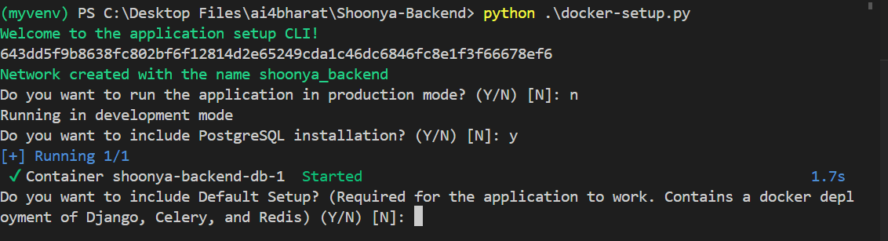
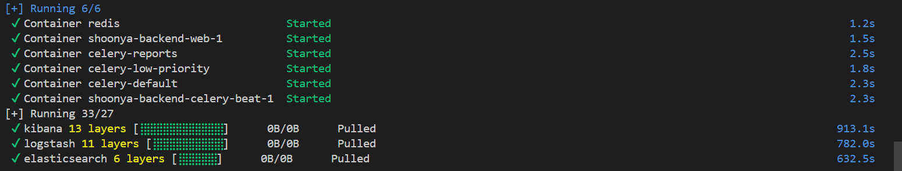

# Shoonya Backend

Repository for Shoonya's backend.

## Pre-requisites

The project was created using [Python 3.7](https://www.python.org/downloads/). All major dependencies along with the versions are listed in the `backend/deploy/requirements.txt` file.


| Systems   | Requirements |
| --------- | ------------ |
| Windows   | Windows 10 or later with at least 8GB of RAM. |
| Ubuntu    | Ubuntu 20.04 or later with at least 4GB of RAM.  |
| Unix/Mac  | macOS 10.13 or later with at least 4GB of RAM. |


## Backend Components and Services
The whole backend setup is divided into mainly 5 Components 
```
Backend Comopnents 
|
|-- 1. Default Components
|   |-- a) Django
|   |-- b) Celery
|   |-- c) Redis
|
|-- 2. Elastic Logstash Kibana (ELK) & Flower Confirguration
|
|-- 3. Nginx-Certbot 
|
|-- 4. Additional Services
|   |-- a) Google Application Credentials
|   |-- b) Ask_Dhruva
|   |-- c) Indic_Trans_V2
|   |-- d) Email Service
|   |-- e) Logging
|   |-- f) Minio
```

> Note : There are some accordian so you need to expand 

<details style="background-color: #ffff;  border-radius: 5px;
::after background-color:ffff"> 
<summary style="background-color: #F5F5F5; color: black; padding: 5px; cursor:pointer;border-bottom:1px solid grey; padding: 5px"> 
  1. Default Components
</summary>

This section outlines the essential setup needed for the application to function properly. It encompasses Docker deployments for Django, Celery, and Redis, which form the core components of our application infrastructure.

#### a) Django
- **Description:** Django is a Python-based framework for web development, providing tools and features to build robust web applications quickly and efficiently.
- Configuration:
  - `SECRET_KEY`: Django secret key either enter manually or generate using the command 

  To create a new secret key, run the following commands (within the virtual environment):
  ```
  # Open a Python shell
  python backend/manage.py shell

  >> from django.core.management.utils import get_random_secret_key
  >> get_random_secret_key()
  ```

#### b) Celery
- **Description:** Celery is a system for asynchronous task processing based on distributed message passing, allowing computationally intensive operations to run in the background without impacting the main application's performance.
- Configuration:
  - `CELERY_BROKER_URL`: Broker for Celery tasks
  

#### c) Redis
- Description: Redis is an open-source, in-memory data structure store used as a database, cache, and message broker.
- Configuration: 
  - `REDIS_HOST`: Need to configue the port
  - `REDIS_PORT` : Need to configure the port

</details>

<details style="background-color: #ffff;  border-radius: 5px;
::after background-color:ffff"> 
<summary style="background-color: #F5F5F5; color: black; padding: 5px; cursor:pointer;border-bottom:1px solid grey; padding: 5px"> 
  2. ELK & Flower configuration
</summary>


#### a) Elasticsearch-Logstash-Kibanas
This section contains the ELK stack for logging monitoring etc.

- Elasticsearch
  - Description: Elasticsearch is a distributed, RESTful search and analytics engine.
  - Configuration:
    - `ELASTICSEARCH_URL`: URL for Elasticsearch
    - `INDEX_NAME`: Index name

- Logstash
  - Description: Logstash is a server-side data processing pipeline that ingests data from multiple sources simultaneously, transforms it, and then sends it to a "stash" like Elasticsearch.
  - Configuration: None

- Kibana
  - Description: Kibana is an open-source data visualization dashboard for Elasticsearch.
  - Configuration: None


#### b) Flower Confirguation
- Flower is a web-based tool for     monitoring and  administrating Celery clusters. It allows you to keep track of tasks as they flow through your system, inspect the 
system's health, and perform administrative operations 
like shutting down workers. 

- Additionally, Flower would be monitoring the 
tasks defined in our tasks/ directory in 
the `backend/directory`. 

- Configuration:
    - `FLOWER_USERNAME`: Flower username
    - `FLOWER_PASSWORD`: Flower password 
    - `FLOWER_PORT`: Need to configure 

</details>

<details style="background-color: #ffff;  border-radius: 5px;
::after background-color:ffff"> 
<summary style="background-color: #F5F5F5; color: black; padding: 5px; cursor:pointer;border-bottom:1px solid grey; padding: 5px"> 
  3. Nginx-Certbot
</summary>

This section contains Nginx and Certbot setup for serving HTTPS traffic.

- Nginx
  - Description: Nginx is a web server that can also be used as a reverse proxy, load balancer, mail proxy, and HTTP cache.
  - Configuration: None

- Certbot
  - Description: Certbot is a free, open-source software tool for automatically using Let's Encrypt certificates on manually-administrated websites to enable HTTPS.
  - Configuration: None

</details>

<details style="background-color: #ffff;  border-radius: 5px;
::after background-color:ffff"> 
<summary style="background-color: #F5F5F5; color: black; padding: 5px; cursor:pointer;border-bottom:1px solid grey; padding: 5px"> 
  4 Additional Services
</summary>


These are the additional services that were not only present in certain confirguration but its actually present in whole files some of them  are global variables and some are services. 

#### a) Google Application Credentials
- **Description**: Google Application Credentials are used to authenticate and authorize applications to use Google Cloud APIs. They are a key part of Google Cloud's IAM (Identity and Access Management) system, and they allow the application to interact with Google's services securely.
- Parameters:
  - `type`
  - `project_id`
  - `private_key_id`
  - `private_key`
  - `client_email`
  - `client_id`
  - `auth_uri`
  - `token_uri`
  - `auth_provider_x509_cert_url`
  - `client_x509_cert_url`
  - `universe_domain`

#### b) Ask_Dhruva
- Description: Component for interacting with Dhruva ASR service.  This service is likely used in your application to convert spoken language into written text.
- Parameters:
  - `ASR_DHRUVA_URL`:  Parameter is used to tell your application where to send requests for speech recognition.
  - `ASR_DHRUVA_AUTHORIZATION`: Authorization token for Dhruva ASR service. 

#### c) Indic_Trans_V2
- Description: Component for interacting with Indic Trans V2 service.
- Parameters:
  - `INDIC_TRANS_V2_KEY`: API key for Indic Trans V2 service
  - `INDIC_TRANS_V2_URL`: URL for Indic Trans V2 service

#### d) Email Service
- **Description**: The Email Service is likely used in your application to send emails. This could be for a variety of purposes such as sending notifications, password resets, confirmation emails, sending reports etc.
- Parameters:
  - `EMAIL_HOST`
  - `SMTP_USERNAME`
  - `SMTP_PASSWORD`
  - `DEFAULT_FROM_EMAIL`

#### e) Logging
- Description:
Logging  is used to record events or actions that occur during the execution of your program. It's a crucial part of software development for debugging and monitoring purposes

- Required for the application to work. Contains a Docker deployment of Django, Celery, and Redis.
- Parameters:
  - `LOGGING` :  This is a boolean value (either 'true' or 
'false') that determines whether logging is enabled. 
  - `LOG_LEVEL` :  This sets the level of logging. 'INFO' will 
log all INFO, WARNING, ERROR, and CRITICAL level 
logs. 

#### f) MINIO
- Description: MinIO is an open-source, high-performance, AWS S3 compatible object storage system. It is typically used in applications for storing unstructured data like photos, videos, log files, backups, and container/VM images.
- Parameters:
  - `MINIO_ACCESS_KEY`
  - `MINIO_SECRET_KEY`
  - `MINIO_ENDPOINT`

</details>

## Setup Instructions

The installation can be done in two ways, each with its own advantages:

1. **Dockerize Installation**: This is the latest, easiest, and most hassle-free installation method. All services will be run under Docker containers and volumes, ensuring a consistent environment and simplifying the setup process.

2. **Default Installation (Without Docker)**: This method involves running the services locally one by one (like Celery and Redis). While this method gives you the most control and visibility into each service, it is more complex and time-consuming. Also, asynchronous tasks won't work under Celery tasks in this setup.

### 1. Dockerize Installation 

###  Pre-requisites
 
If you are choosing dockerize method then you need to install following things

- **Docker Engine/Docker Desktop running** 
    You may download Docker Desktop from the table given below 
        
  | Systems| Link |
  | ---------- | ------ |
  | Windows | https://docs.docker.com/desktop/install/windows-install/ |
  | Ubuntu | https://docs.docker.com/desktop/install/ubuntu/ |
  | Unix/Mac | https://docs.docker.com/desktop/install/mac-install/|
- Python Version 3.7 or above 
- An Azure account subscription.
- Google cloud subscriptions (mentioned above the backend components)


### Running the Setup Script

To run the setup script:
1. Clone this repository to your local machine.

    ```bash
    git clone "https://github.com/AI4Bharat/Shoonya-Backend"
    ```
2. Navigate to the root directory of the project.
    ```bash 
    cd Shoonya-Backend
    pip install -r ./backend/deploy/requirements.txt
    ```

3. Run the following command: `python docker-setup.py` make sure the docker engine is running on your system

    

4. Provide the details that has been asking in the prompt and it will automatically create & run  the docker containers, volumes and processes 
    

5. Once everything has been asked it will start creating containers and volumes and the server will get started on `http://localhost:8000` all the respective services will run on the provided ports 

### What the script does?
- Automatically creates a Docker network named `shoonya_backend`.
- Prompts the user to choose whether to run the application in production mode.
- Guides the user through setting up a PostgreSQL container if desired.
- Allows selection of components and sets up Docker Compose files accordingly.
- Manages environment variables in the `.env` file for each selected component.
- Deploys Docker containers for selected components.
- Provides feedback and error handling throughout the setup process.


### 2. Default Installation (Without Docker) 

###  Pre-requisites

#### Create a Virtual Environment

We recommend you to create a virtual environment to install all the dependencies required for the project.

For **Ubuntu/Mac**:

```bash
python3 -m venv <YOUR-ENVIRONMENT-NAME>
source <YOUR-ENVIRONMENT-NAME>/bin/activate
```
For **Windows**:
```bash
python -m venv <YOUR-ENVIRONMENT-NAME>
<YOUR-ENVIRONMENT-NAME>\Scripts\activate
```

#### Running the Setup Script

  1. Clone this repository to your local machine.

      ```bash
      git clone "https://github.com/AI4Bharat/Shoonya-Backend"
      ```
  2. Navigate to the root directory of the project.
      ```bash 
      cd Shoonya-Backend
      pip install -r ./backend/deploy/requirements.txt
      ```

 3. To set up the environment variables needed for the project, run the following lines:

      ```bash 
      cp .env.example ./backend/.env
      ```

4. Update the ./backend/.env file with your own credentials 

5. Run the command in the terminal to start the server  server will be running on port `8000`
    ```bash 
        python ./backend/manage.py runserver
    ```

### Google Cloud Logging (Optional)

If Google Cloud Logging is being used, please follow these additional steps:

1. Install the `google-cloud-logging` library using the following command:
```bash
pip install google-cloud-logging
```
2. Follow the steps to create a Service Account from the following [Google Cloud Documentation Page](https://cloud.google.com/docs/authentication/production#create_service_account).   This will create a Service Account and generate a JSON Key for the Service Account.
3. Ensure that atleast the Project Logs Writer role (`roles/logging.logWriter`) is assigned to the created Service Account.
4. Add the `GOOGLE_APPLICATION_CREDENTIALS` variable to the `.env` file. This value of this variable should be the path to the JSON Key generated in Step 2. For example,

```bash
GOOGLE_APPLICATION_CREDENTIALS="/path/to/gcloud-key.json"
```


### Run Migrations (required only for the first time running the project or if you make any changes in the models)
Run the following commands:
```bash
# Check if there are any pending migrations
docker-compose exec web python manage.py makemigrations 

# Run all pending migrations
docker-compose exec web python manage.py migrate

# Create a superuser
docker-compose exec web python manage.py createsuperuser
``` 


If there were no errors, congratulations! The project is up and running.

If your preference is 2 over 1 please be fixed to this environment and follow the steps below it:

- Ubuntu 20.04 OR macOs

You can run the following script and each and every step for setting the codebase will be done directly. Please move to a folder in your local where you would like to store the code and run the script given below there:
```bash
os=$(uname)

if [ "$os" = "Linux" ] || [ "$os" = "Darwin" ]; then

git clone https://github.com/AI4Bharat/Shoonya-Backend.git
cd Shoonya-Backend
git checkout dev
git pull origin dev
cp .env.example ./backend/.env
cd backend
python3 -m venv  venv
source venv/bin/activate

pip install -r ./deploy/requirements.txt

new_secret_key=$(python3 -c "from django.core.management.utils import get_random_secret_key; print(get_random_secret_key())")

env_file=".env"
if sed --version 2>&1 | grep -q 'GNU sed'; then
  sed -i "/^SECRET_KEY=/d" "$env_file"
else
  sed -i.bak "/^SECRET_KEY=/d" "$env_file"
  rm -f "$env_file.bak"
fi

echo "SECRET_KEY='$new_secret_key'" >> "$env_file"

echo "New secret key has been generated and updated in $env_file"

else
  echo "Cannot run this script on: $os"
fi
  ```

### Running background tasks 
Please install and run redis from https://redis.io/download/ on port 6379 before starting celery. 

To run background tasks for project creation, we need to run the following command in the terminal. This has also been added into the `docker-compose.yml` file.
```bash 
celery command - celery -A shoonya_backend.celery worker -l info
celery command - celery -A shoonya_backend.celery beat --loglevel=info
```

You can set use the celery to local by modifying `CELERY_BROKER_URL = "redis://localhost:6379/0"` in ./backend/shoonya_backend/settings.py.

We can set the concurrency and autoscale in the process as well to manage the number of worker processes in the background. Read more [here](https://stackoverflow.com/a/72366865/9757174). 

The commands will be as follows 
```bash 
celery -A shoonya_backend.celery worker --concurrency=2 --loglevel=info
celery -A shoonya_backend.celery worker --autoscale=10,3 --loglevel=info
```

### Running Linters

In case you want to raise a PR, kindly run linters as specified below. You can install black by running pip install black and use `black` 
To run `black` do:

```bash
black ./backend/
```

Happy Coding!!

